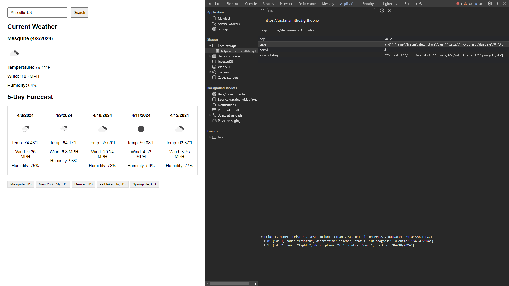
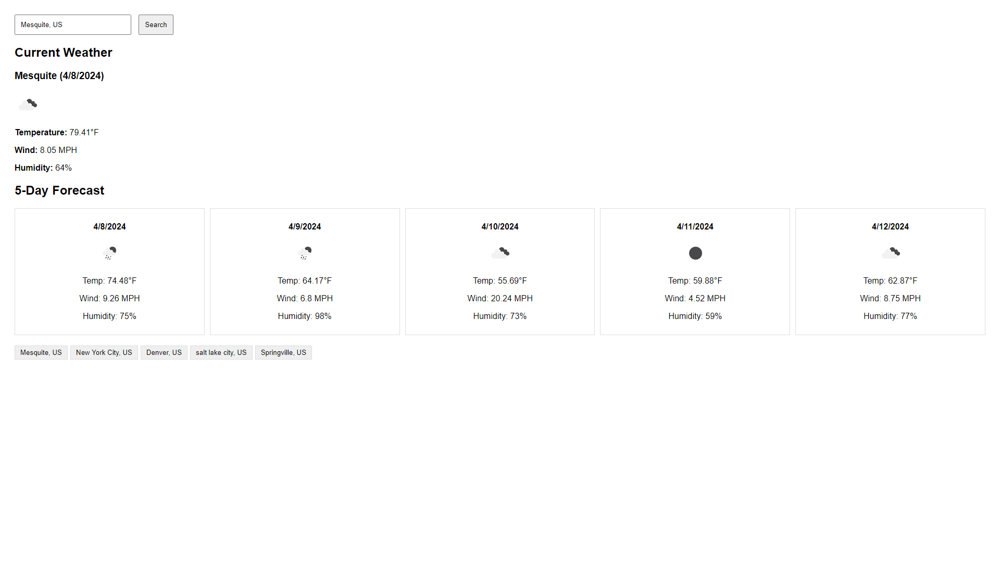
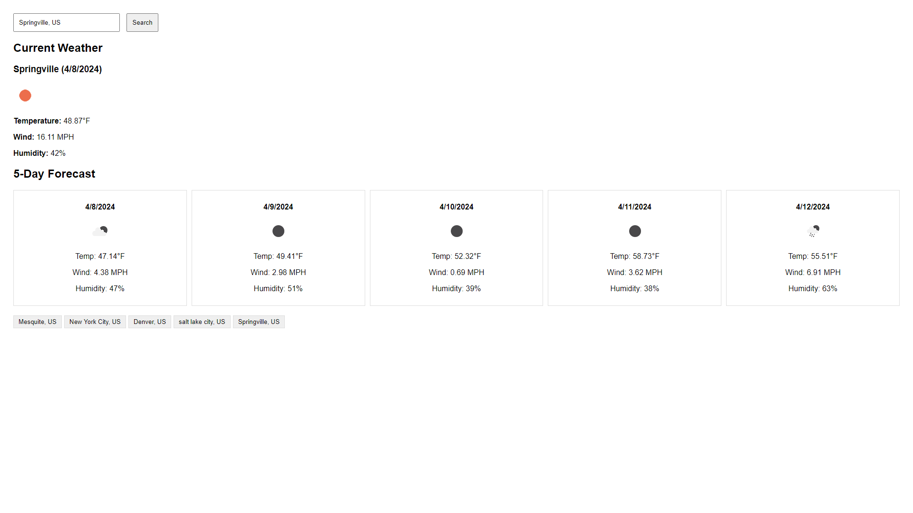

# Weather-Dashboard
A dashboard for weather 
Assignment #6
## Installation
No Installation required
## Usage
This is used to track weather, and to show that i can pull Server Side API's and use them.
## Contribution 
Tristan Smith
## Photos
Screenshots of the page showing that my local storage is saving the infomation.
Showing differnce locations and theyre 5days forcast. 
 
 

## linked
https://tristansmith63.github.io/Weather-Dashboard/